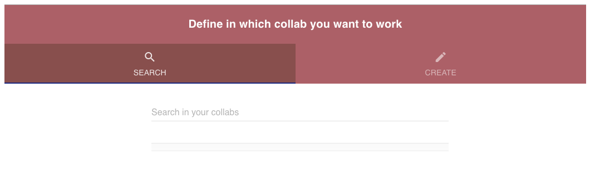
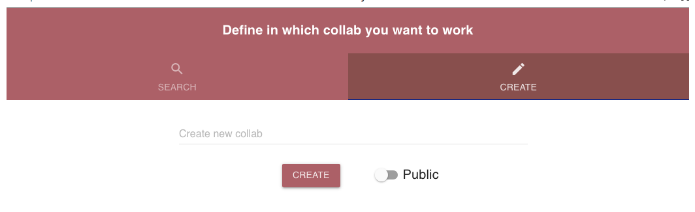
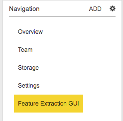

.. _getting_started:

###############
Getting started
###############

The Brain Simulation Platform (BSP) is organized around several “Online Use Cases” and “Model Collabs”. From there, in a few clicks you will be guided to specific practical ways to use the BSP in such a way to be almost immediately productive.

As with most scientific instruments, access to advanced functionality may be subject to certain conditions. This is due to the early state of the Platform and to the fact that it relies on limited resources, such as supercomputers.
Please see the table at the end of this section regarding the services the Brain Simulation Platform (BSP) provides to different user classes at this point in time.

But first a quick overview is given on how to work with "Collabs" and how the use cases are organized:

.. _working-with-collabs:

********************
Working with Collabs
********************

The central scientific working place in the Brain Simulation Platform are the 'Collabs' (from 'Collaboration').  A Collab is an area in which one or more scientists can work on different/multiple tasks.
An user is able to create a new Collab, use an existing one, add use cases to this Collab, and to invite colleagues from the scientific community to collaborate.

Usually, when an user chooses an use case to work on, the following screen is presented to let the user select an existing Collab or to create a new Collab:

Here you can enter the name of an existing Collab; any matching Collab will be listed and you can click it. Or you can select 'Create new Collab' which will lead to the following screen:

If you selected a Collab where the use case is already present, a dialog will appear asking you if you want to replace the content of the files with the new ones or if you want to be redirected to the old use case.

.. image:: images/replace.png
    :scale: 90%
    :align: right

When you create a new Collab, the steps are easy:

1. You select an meaningful name for the Collab (example: "Henry CA1 Connectome").
2. You click on "Create" (You can choose of the Collab can be seen by anyone, or if its Private. You can change this later anytime).
3. Then the actual notebook or GUI of the use case you initially selected should open up.

A new Collab will open with your use case(s) and several options:

Here you have different possibilities to configure the Collab or to see some statistics:

**Overview**
  Will display recent activities in the Collab.

**Team**
  Here you can invite a colleague to collaborate

**Storage**
  Here you can see what data and files are in the Collab-storage. You can upload and download files to/from that storage space.

**Settings**
  Here you can change the privacy of the Collab and rename it, if required.

*********************
Use case Organization
*********************

.. container:: bsp-container-left

    .. image:: images/bsp_scheme.png
        :scale: 60%
        :align: right

A schematic organization of the use cases workflow is shown in the figure on the left. An important aspect of the workflow is that it is open to the entire neuroscience community. This means that no matter if you belong to an HBP partner Institution, an external Laboratory/Company, or you are just a curious student, you can be invited to have a HBP account and will have access to the use cases. The only restriction will be on the type of data you will able to work with, and the resources that you can use.

|

So, here are a few simple typical steps you can follow to start your project:

1. Navigate the use cases list to decide/find the one most appropriate to what you would like to do; the system will show you in some detail what is already available, based on your account accreditation;
2. Once you choose the use case, the platform will guide you to create a new collab (or to add the use case to one of your existing collabs); all code and HBP-generated experimental data and models needed to execute the use case will be copied there; in several cases you can also upload and work with your own data;
3. Use your own imagination and collaborate with your team to pursue your scientific work, by using the tools already available or create new ones;
4. Once you are satisfied with the results, you can download them and/or make your work available to other users by releasing it into the HBP database; our support team can eventually also help you in creating a new use case.

|

This is the theory, but in practice what you can do with a use case will of course depend on your background and expertize. The BSP follows a user centric development, to enable users with different backgrounds and skill level to exploit the Platform’s capabilities to pursue scientific goals.
Also, keep in mind that use cases are constantly updated, to improve their functionalities and usability, and may require different types of resources. To help you in deciding if a specific use case is appropriate for your expertise, each one is marked with intuitive icons, indicating the expected user experience, the use case maturity, and the type of resources required. You will see these icons on the rightmost part of the use case buttons, as in the figure below:

.. container:: bsp-container-center

    .. image:: images/usecase_button.png
        :scale: 70%
        :align: right
        :class: bsp-center

|

Here is what they mean:

===============
User experience
===============

.. container:: bsp-container-left

    .. image:: images/everybody_tag.png
        :scale: 70%

**End users:** interested in using the BSP infrastructure and facilities in the most user-friendly way, for relatively simple collaborative scientific projects using GUIs and public HPC resources, such as a Cloud Computing or the Neuroscience Gateway (NSG); they know the electrophysiological mechanisms underlying a neuron’s behavior (ion channels, synaptic and firing properties, etc) and understand how to run a simple simulation, but they have no background experience on programming languages such as python and/or the NEURON simulation environment.

.. container:: bsp-container-left

    .. image:: images/poweruser_tag.png
        :scale: 70%

**Power user:** interested in using the BSP infrastructure and facilities for collaborative projects using public resources (such as the NSG), or their own HPC grants on one of the supercomputer centers supporting HBP activities (JSC and CINECA). These users are able to design, implement, run, and analyze models and simulations using the NEURON simulation environment; they understand the information needed to implement and run a simulation of morphologically and biophysically accurate neurons, and they have a working knowledge of python.

.. container:: bsp-container-left

    .. image:: images/experts_tag.png
        :scale: 70%

**Experts and co-design partners:** users with a good knowledge of the inner working of collabs/apps/webservices and/or a substantial expertize in implementing simulations of morphologically and biophysically accurate neurons and networks to model brain functions; they contribute to the development of new use cases/models.

.. container:: bsp-container-left

    .. image:: images/developer_tag.png
        :scale: 70%

**Code developers:** designers and early adopters of initial versions of collabs/apps/webservices/models; they are top experts in their respective ICT and/or neuroscience field. Use cases showing this icon are usually restricted to collabs with a team composed of mostly HBP partners for developing/testing advanced topics.

|

=================
Use case maturity
=================

.. container:: bsp-container-left

    .. image:: images/beta_tag.png
        :scale: 50%

.. container:: bsp-inline-text

    A service of this maturity level has reached a certain robustness and may be used by early adopters.

.. container:: bsp-container-left

    .. image:: images/experimental_tag.png
        :scale: 50%

.. container:: bsp-inline-text

    A service of this maturity level is under heavy development and recommended only for specialists’ use or use for co-design partners.

|

==========
HPC access
==========

.. container:: bsp-container-left

    .. image:: images/hpc_tag.png
        :scale: 50%

.. container:: bsp-inline-text

    Use cases with this icon require a small to medium amount of High-Performance Computing resources. They can be either public, such as those available through the NSG, or provided by the user through a personal grant, such as a PRACE award, on one of the supercomputer centers supporting HBP activities (JSC and CINECA).

.. container:: bsp-container-left

    .. image:: images/byo_tag.png
        :scale: 50%

.. container:: bsp-inline-text

    This type of use cases needs large HPC resources. Typically, use cases showing this icon involve complex simulations of large scale cellular level model of brain areas/regions, that are deployed on JSC and CINECA systems. Subjected to technical compatibility and license agreement, this type of simulations can be delegated to be executed on other HPC systems, outside the BSP.

.. _nsg:

""""""""""""""""""""""""""
Neuroscience Gateway (NSG)
""""""""""""""""""""""""""

The Neuroscience Gateway (NSG) portal https://www.nsgportal.org/ facilitates access and use of National Science Foundation (NSF) High Performance Computing (HPC) resources by neuroscientists. Computational modeling of cells and networks has become an essential part of neuroscience research, and investigators are using models to address problems of ever increasing complexity, e.g. large scale network models and optimization or exploration of high dimensional parameter spaces. The NSG catalyzes such research by lowering or eliminating the administrative and technical barriers that currently make it difficult for investigators to use HPC resources. It offers free computer time to neuroscientists acquired via the supercomputer time allocation process managed by the Extreme Science and Engineering Discovery Environment (XSEDE) Resource Allocation Committee (XRAC). The portal provides access to the popular computational neuroscience tools installed on various HPC resources. It also provides a community mailing list for neuroscientists to collaborate and share ideas.

NSG can be accessed through a simple web portal or programmatically using RESTful services. The NSG provides an administratively and technologically streamlined environment for uploading models, specifying HPC job parameters, querying running job status, receiving job completion notices, and storing and retrieving output data. The NSG transparently distributes user's jobs to appropriate XSEDE HPC resources.

For the use cases referring to hippocampal cells, NSG will be accessed programmatically using RESTful services.

Successful job submission returns a message at each major processing point, as well as when problems are encountered. Each message has a timestamp, processing stage, and textual description. A job progresses through the following stages:

-	QUEUE - The job has been validated and placed in NSG's queue.
-	COMMANDRENDERING - The job has reached the head of the queue and NSG has created the command line that will be run.
-	INPUTSTAGING - NSG has created a temporary working directory for the job on the execution host and copied the input files over.
-	SUBMITTED - The job has been submited to the scheduler on the execution host.
-	LOAD_RESULTS - The job has finished running on the execution host and NSG has begun to transfer the results.
-	COMPLETED - Results successfully transferred and available.

S Sivagnanam, A Majumdar, K Yoshimoto, V Astakhov, A Bandrowski, M. E. Martone, and N. T. Carnevale. Introducing the Neuroscience Gateway, IWSG, volume 993 of CEUR Workshop Proceedings, CEUR-WS.org, 2013.

*********************
Service Accessibility
*********************

.. list-table::
    :header-rows: 1

    * - Class
      - Who?
      - What?
      - Terms
      - Support
    * - ANONYMOUS
      - anyone
      - * Download open source software from github accounts of SP6 partners
      - * license terms of respective software
      - * support through channels indicated with the respective software
        * community support through HBP Forum
    * - HBP IDENTITY
      - anyone with an HBP Identity Account
      - * Browse BSP use case Collabs
        * Browse BSP model Collabs
        * Can be added to private Collabs by Collab owners
        * Restricted access to apps: limited functionality or limited access
      - * license terms of respective software
        * HBP Collaboratory or Platform Terms of Service for accessible services
      - * Best effort support
        * send inquiries to bsp-support@humanbrainproject.eu
    * - PROJECT ACCESS
      - anyone who belongs to an HBP Partnering Project (or similar agreement)
      - * All rights of HBP Identity class
        * Access to the online functionality of the Brain Simulation Platform if requested in the Partnering Project agreement
        * Access to HBP models in the Brain Simulation Platform if requested in the Partnering Project agreement
        * HPC resources (*)
      - * license terms of respective software
        * HBP Collaboratory or Platform Terms of Service for accessible services
        * Terms of the Partnering Project agreement (or similar agreement)
      - * Full support according to terms of Partnering Project agreement
        * send inquiries and support requests to bsp-support@humanbrainproject.eu
    * - HBP MEMBERS
      - Anyone who belongs to an HBP partner institution and is granted accreditation to a particular HBP Subproject
      - * All rights of HBP Identity class
        * Access to the online functionality of the Brain Simulation Platform
        * Access to HBP models in the Brain Simulation Platform
        * HPC resources (*)
      - * HBP Consortium Agreement
      - * Full support
        * send inquiries and support requests to bsp-support@humanbrainproject.eu

|

(*) Note that access to HPC resources are subject to independent peer review by the HPC platform. During the partnering project accession process, application to required resources will be coordinated. More information on HPC accounts and allocations can be found on the `HPC Platform <https://collab.humanbrainproject.eu/#/collab/264/nav/3304>`_. For an overview of accessibility of services from other platforms, please look `here <https://collab.humanbrainproject.eu/#/collab/19/nav/6601>`_.
