.. _conf_run_hippo_pre:

Configure and run a rat hippocampus CA1 region using preconfigured HBP model and data
~~~~~~~~~~~~~~~~~~~~~~~~~~~~~~~~~~~~~~~~~~~~~~~~~~~~~~~~~~~~~~~~~~~~~~~~~~~~~~~~~~~~~

This use case allows a user to configure and launch a simulation on HBP HPAC infrastructure using `Unicore API <https://www.unicore.eu/>`__.

===============
Run Simulations
===============

|run_simulation|

In the **Section 1)** you can configure:

-  ``Population``: Population of cells to be loaded by the simulator.
-  ``Duration``: Time length of stimulus duration, given in
   milliseconds(ms)
-  ``View Simulations``: From here you can see all the history of
   simulations (explained in page `View Simulations <#view-simulations>`_)

In the **Section 2)** you can configure:

-  Using the buttons |edit_buttons| you can ``add``, ``edit`` or ``remove`` new stimulus/report (You can also
   double-click on the timeline to add or edit)

-  ``Stimulations`` configuration:

  -  *Population*: Name of a population to receive the stimulation
  -  *Delay*: Time when the stimulus commences, given in
     milliseconds(ms)
  -  *Duration*: Time length of stimulus duration, given in
     milliseconds(ms)
  -  *Pattern*: Type of stimulus to inject
  -  *Synapses per cell*: The number of synapses to create
  -  *Lambda*: Configure the random distribution
  -  *Weight*: The strength of the created synapses

    |edit_stimulus|

-  ``Reports``

  -  *Population*: Defines the population from where the data will be reported.
  -  *StartTime*: Time to start reporting(ms)
  -  *EndTime*: Time to stop reporting(ms)
  -  *Compartments*: Which compartment(s) to report [Soma = compartment, Soma + Dendrites = AllCompartments]
  -  *ReportOn*: What to report [Voltage, Calcium Concentration, Current Summation (for LFP)]
  -  *dt*: The frequency of reporting in milliseconds(ms)
  -  *Format*: Defines the report output format [Binary (.bbp), ASCII, HDF5]

    |edit_report|

In the **Section 3)** you can modify the **connection** between populations on the circuit specifying:

- *Source:* This target defines presynaptic cells
- *Destination:* This target defines postsynaptic cells
- *Delay (ms):* A delay after which the modifications are applied
- *Weight:* A scaling factor to adjust the synaptic strength (default = 1)
- *MinisFreq:* The Poisson mean rate for spontaneous synaptic activity
- *Synapse Configuration:* Snippets of hoc code to manipulate additional synaptic parameters

  |connection_manipulation|

  - If you want to modify a synpase just click *configure* and a pop-up will appear

    |synapse_configurator|

In the **Section 4)**  you can modify the **projection** going to the circuit

- *Weight:* A scaling factor to adjust the synaptic strength (default = 1)
- *Minis Projection:* Generate inputs based on spontaneous synaptic activity
  - *Frequency (Hz):* Frequency of the spontaneous synaptic activity
- *Spike Replay Projection:* Generate inputs based on a given distribution

  - *Target:* From which cells the projection is coming
  - *Frequency (Hz):* The input mean rate
  - *Stimulus Type:* Type of distribution (default = Poisson)

    |projection_manipulation|

  - If you want to modify a projection just click *configure* and a pop-up will appear

    |projection_edition|

- Launching a simulation will open a form to configure the parameters before executing the jobs on the supercomputer

 - *Title*: The title of the job
 - *Computer*: Which supercomputer will run the simulation.
 - *Project*: (optional) If you want to specify under which project the simulation should be run
 - *Nodes*: The amount of nodes that will be allocated and used for the simulation
 - *Run Time*: The maximum time before timeout (in seconds).
 - *CPUs Per Node*: Number of CPUs that are going to be used for the simulation.
 - *Total Processors*: The total amount (nodes * cpus).
 - *Preview BlueConfig*: This will open a new tab with the complete configuration that is going to be sent

   |run_simulation_form|

--------------

================
View Simulations
================

|view_simulation|

In the **Section 1)** you are able to:

-  ``Filter`` by *Title*, *Status*, *Supercomputer*, *Project*
-  ``Import Simulation`` providing the full path to simulation folder on that HPC
-  ``Launch Simulation``: this goes back to *Configure and Launch
   simuation* page

In the **Section 2)** you are able to:

-  ``Check status`` of Simulation and Analysis steps:

   - ready |done|
   - queue |sync|
   - aborted |block|
   - failed |error|

-  ``View`` the details page of the simulation.

-  ``Analyse`` will open a form to configure the parameters before executing the analysis on the supercomputer

   -  *Title*: Title of the job
   -  *Analysis*: Type of analysis to run
   -  *Population*: Population cells used for the simulation
   -  *Report*: Report created by the simulation
   -  *Cells*: Number of random cells to analyze

      |run_analysis_form|

-  ``Delete`` the simulation

--------------

==================
Simulation Details
==================

|simulation_details|

In the **Section 1)** you are able to see:

- ``Simulation`` with the following information

  - *Name*
  - *ID*
  - *Status*
  - *Submission Date*

In the **Section 2)** you are able to see:

  - *Analysis*: Plots of the analysis will be shown here
  - *BlueConfig*: The configuration that was sent to run the simulation
  - *Files*: List of files that the simulation produced
  - *Technical Logs*:

    - *Unicore Logs*
    - *Stderr*: Logs of the simulation
    - *Stdout*: Output information of the simulation

The ``Analysis`` section shows the different analyses the user has run

  |simulation_details_analysis|

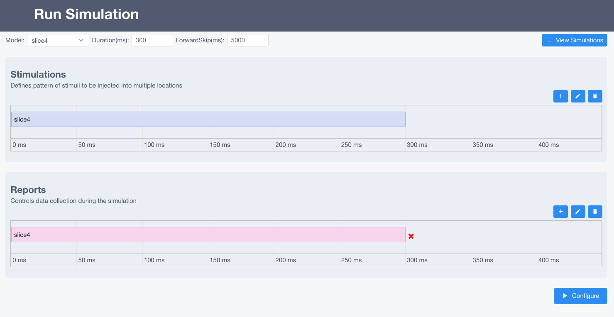

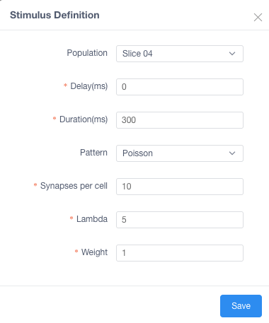
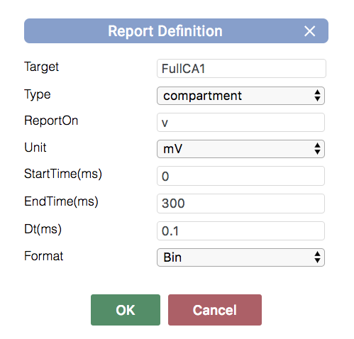
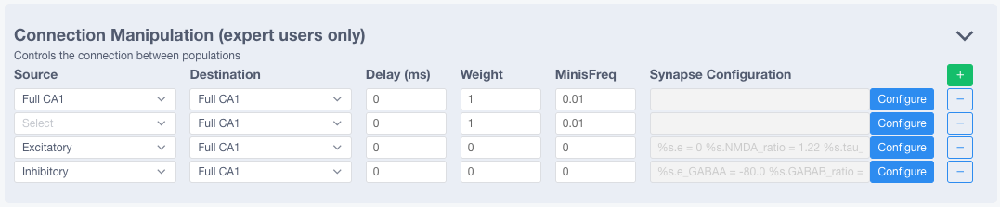
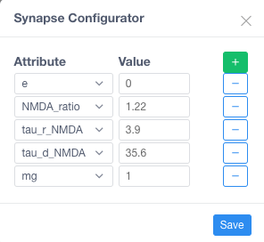
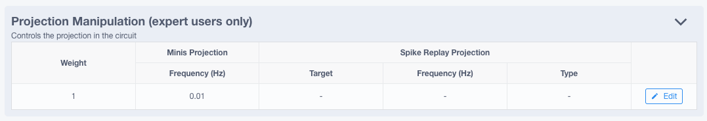
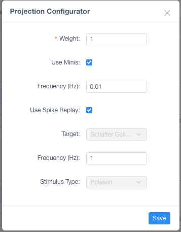
.. |run_simulation_form| image:: images/run_simulation_form.png
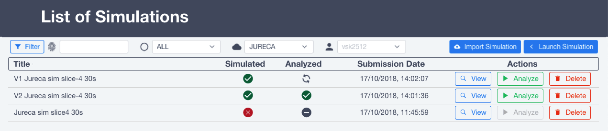

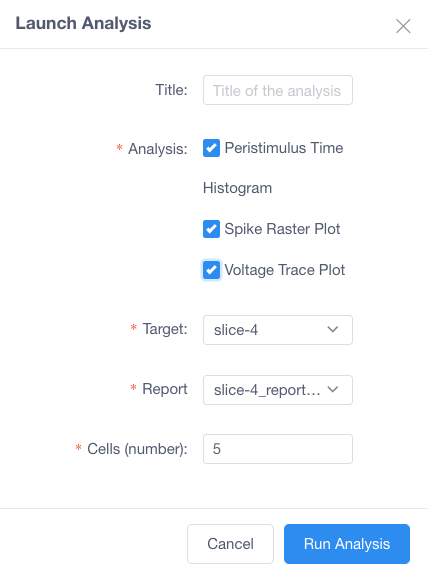
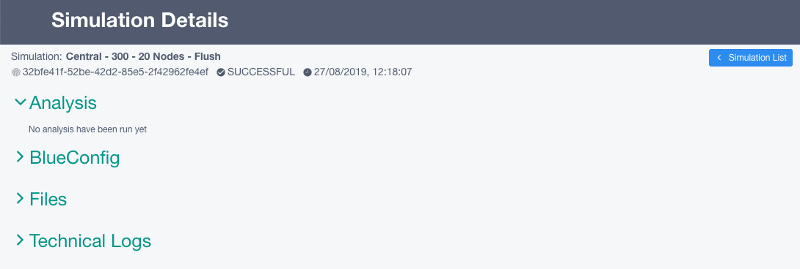
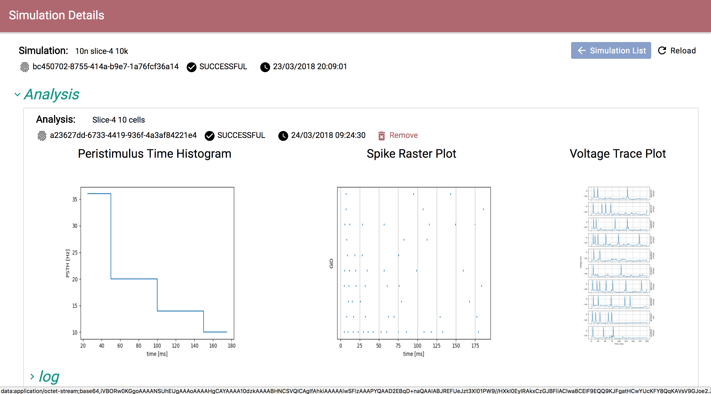
