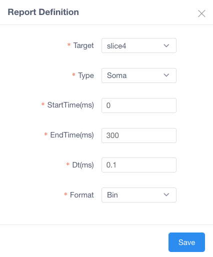
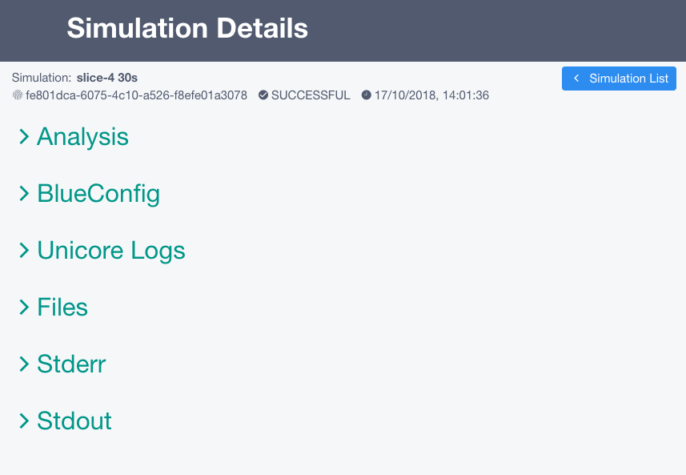

Configure and run a rat hippocampus CA1 region using preconfigured HBP model and data
~~~~~~~~~~~~~~~~~~~~~~~~~~~~~~~~~~~~~~~~~~~~~~~~~~~~~~~~~~~~~~~~~~~~~~~~~~~~~~~~~~~~~

This use case allows a user to configure and launch a simulation on HBP HPAC infrastructure using `Unicore API <https://www.unicore.eu/>`__.

Run Simulations
===============

|run_simulation|

----------------

From the **top** you can configure:

   |run_simulation_top|

-  ``Population``: Population of cells to be loaded by the simulator.
-  ``Duration``: Time length of stimulus duration, given in
   milliseconds(ms)
-  ``View Simulations``: From here you can see all the history of
   simulations (explained in section **2**)

--------------

From the **middle** you can configure:

   |run_simulation_middle|

-  ``add`` new stimulus/report, ``edit`` or ``remove`` (You can also
   double-click on the timeline to add or edit)

   |edit_buttons|

-  ``Stimulations``

   -  For creation or edition of the item a form will appear

      -  *Population*: Name of a population to receive the stimulation
      -  *Delay*: Time when the stimulus commences, given in
         milliseconds(ms)
      -  *Duration*: Time length of stimulus duration, given in
         milliseconds(ms)
      -  *Number of synapses*: The number of synapses to create
      -  *Pattern*: Type of stimulus to inject
      -  *Lambda*: Configure the random distribution
      -  *Weight*: The strength of the created synapses

         |edit_stimulus|

-  ``Reports``

   -  For creation or edition of the item a form will appear

      -  *Population*: Defines the region from where the data will be
         reported.
      -  *Type*: Compartment means that each compartment outputs
         separately in the report file. Synapse indicates that each
         synapse will have a separate entry in the report [compartment,
         synapse]
      -  *StartTime*: Time to start reporting(ms)
      -  *EndTime*: Time to stop reporting(ms)
      -  *Dt*: The frequency of reporting in milliseconds(ms)
      -  *Format*: Defines the report output format [Bin, ASCII, HDF5]

         |edit_report|

--------------

From the **bottom** you can modify the ``connections`` and ``launch`` the simulation

- You can modify the connection between populations on the circuit specifying

 - *Source:* This target defines presynaptic cells
 - *Destination:* This target defines postsynaptic cells
 - *Delay (ms):* A delay after which the modifications are applied
 - *Weight:* A scaling factor to adjust the synaptic strength (default = 1)
 - *MinisFreq:* The Poisson mean rate for miniature events
 - *Synapse Configuration:* Snippets of hoc code to manipulate additional synaptic parameters

   |connection_manipulation|

   - If you want to modify a synpase just click *configure* and a pop-up will appear

      |synapse_configurator|

- Launching a simulation will open a form to configure the parameters before executing the jobs on the supercomputer

 - *Title*: The title of the job
 - *Computer*: Which supercomputer will run the simulation.
 - *Project*: (optional) If you want to specify under which project the simulation should be run
 - *Nodes*: The amount of nodes that will be allocated and used for the simulation
 - *Run Time*: The maximum time before timeout (in seconds).
 - *CPUs Per Node*: Number of CPUs that are going to be used for the simulation.
 - *Total Processors*: The total amount (nodes * cpus).
 - *Preview BlueConfig*: This will open a new tab with the complete configuration that is going to be sent

   |run_simulation_form|

View Simulations
================

|view_simulation|

--------------

From the **top** you are able to: |view_simulation_top|

-  ``Filter`` by *Title*, *Status*, *Supercomputer*, *Project*
-  ``Import Simulation`` providing the full path to simulation folder on that HPC
-  ``Launch Simulation``: this goes back to *Configure and Launch
   simuation* page

--------------

From the **middle** you are able to:

|view_simulation_middle|

-  ``Check status`` of Simulation and Analysis steps:

   - ready |done|
   - queue |sync|
   - aborted |block|
   - failed |error|

-  ``Run Analysis`` if no analysis was launched you can do it from the
   analysis step

   -  This will open a form to configure the parameters before executing
      the analysis on the supercomputer

      -  *Title*: Title of the job
      -  *Analysis*: Type of analysis to run
      -  *Population*: Population cells used for the simulation
      -  *Report*: Report created by the simulation
      -  *Cells*: Number of random cells to analyze

         |run_analysis_form|

-  ``Delete`` the simulation

Simulation Details
==================

|simulation_details|

From the **top** you are able to see:

|simulation_details_top|

- ``Simulation`` with the following information

   - *Name*
   - *ID*
   - *Status*
   - *Submission Date*

From the **middle** you are able to see:

   - *Analysis*: Plots of the analysis will be shown here
   - *BlueConfig*: The configuration that was sent to run the simulation
   - *Unicore Logs*
   - *Files*: List of files that the simulation produced
   - *Stderr*: Logs of the simulation
   - *Stdout*: Output information of the simulation

      |simulation_details_middle|

In ``Analysis`` section shows the different analysis the user has run

   |simulation_details_analysis|

.. |run_simulation_top| image:: images/run_simulation_top.png
.. |run_simulation_middle| image:: images/run_simulation_middle.png

.. |edit_stimulus| image:: images/edit_stimulus.png

.. |connection_manipulation| image:: images/connection_manipulation.png
.. |synapse_configurator| image:: images/synapse_configurator.png
.. |run_simulation_form| image:: images/run_simulation_form.png
.. |view_simulation| image:: images/view_simulation.png
.. |view_simulation_top| image:: images/view_simulation_top.png
.. |view_simulation_middle| image:: images/view_simulation_middle.png
.. |done| image:: images/done.png
.. |sync| image:: images/sync.png
.. |block| image:: images/block.png
.. |error| image:: images/error.png

.. |simulation_details_middle| image:: images/simulation_details_middle.png
.. |simulation_details_analysis| image:: images/simulation_details_analysis.png
.. |simulation_details_top| image:: images/simulation_details_top.png
