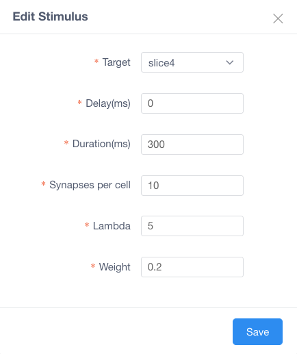
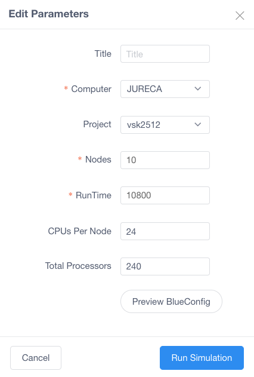
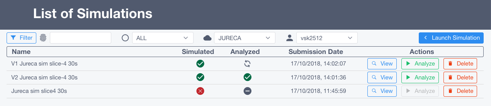
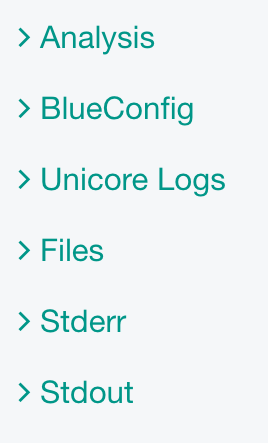
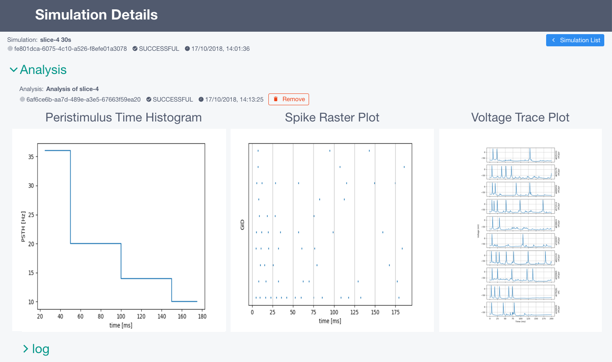

Configure and run a rat hippocampus CA1 region using preconfigured HBP model and data
~~~~~~~~~~~~~~~~~~~~~~~~~~~~~~~~~~~~~~~~~~~~~~~~~~~~~~~~~~~~~~~~~~~~~~~~~~~~~~~~~~~~~

This use case allows a user to configure and launch a simulation on HBP HPAC infrastructure using `Unicore API <https://www.unicore.eu/>`__.

Run Simulations
===============

|run_simulation|

----------------

From the **top** you can configure:

   |run_simulation_top|

-  ``Duration``: Time length of stimulus duration, given in
   milliseconds(ms)
-  ``Forward Skip``: Time length in milliseconds (ms) of running the
   simulation without stimulus and without reporting. This is to get the
   neuronal cells past any initial transience
-  ``View Simulations``: From here you can see all the history of
   simulations (explained in section **2**)

--------------

From the **middle** you can configure:

   |run_simulation_middle|

-  ``add`` new stimulus/report, ``edit`` or ``remove`` (You can also
   double-click on the timeline to add or edit)

   |edit_buttons|

-  ``Slices Selector`` allows to pick a slice of the hippocampus and it
   will add this to the *stimulus* / *report*

   |stimulus_selector|

-  ``Stimulations``

   -  For creation or edition of the item a form will appear

      -  *Target*: Name of a target to receive the stimulation
      -  *Delay*: Time when the stimulus commences, given in
         milliseconds(ms)
      -  *Duration*: Time length of stimulus duration, given in
         milliseconds(ms)  
      -  *Synapses per cell*: The number of synapses to create
      -  *Pattern*: Type of the stimulus [Poisson]
      -  *Lambda*: Configure the random distribution
      -  *Weight*: The strength of the created synapses

   |edit_stimulus|

-  ``Reports``

   -  For creation or edition of the item a form will appear

      -  *Target*: Defines the region from where the data will be
         reported. Note that cell targets versus compartment targets can
         influence report behavior
      -  *Type*: Soma (compartment) means that each compartment outputs
         separately in the report file. Synapse indicates that each
         synapse will have a separate entry in the report [compartment,
         synapse]
      -  *StartTime*: Time to start reporting(ms)
      -  *EndTime*: Time to stop reporting(ms)
      -  *Dt*: The frequency of reporting in milliseconds(ms)
      -  *Format*: Defines the report output format [Bin, ASCII, HDF5]

   |edit_report|

--------------

From the **bottom** you can ``launch`` the simulation

- This will open a form to configure the parameters before executing the jobs on the supercomputer

 - *Title*: The title of the job
 - *Computer*: Which supercomputer will run the simulation.
 - *Project*: Select under which account you want to run the simulation.
 - *Nodes*: The amount of nodes that will be allocated and used for the simulation
 - *Run Time*: The maximum time before timeout (in seconds)
 - *Preview Config*: This will open a new tab with the complete configuration that is going to be sent (BlueConfig)

   |run_simulation_form|

View Simulations
================

|view_simulation|

--------------

From the **top** you are able to: |view_simulation_top|

-  ``Filter`` by *Title*, *Status*, *Supercomputer*
-  ``Create Simulation``: this goes back to *Configure and Launch
   simuation* page
-  ``Reload``: to fetch the latest simulations and status

--------------

From the **middle** you are able to:

|view_simulation_middle|

-  ``Check status`` of Simulation and Analysis steps:

   - ready |done|
   - queue |sync|
   - aborted |block|
   - failed |error|

-  ``Run Analysis`` if no analysis was launched you can do it from the
   analysis step

   -  This will open a form to configure the parameters before executing
      the analysis on the supercomputer

      -  *Title*: Title of the job
      -  *Origin*: Supercomputer where the simulation output are located
      -  *Destination*: Supercomputer that the output files from
         simulation will be copied to and start the analysis
      -  *Nodes*: Number of nodes dedicated for the analysis job

         |run_analysis_form|

-  ``Delete`` the simulation
-  ``Abort`` the simulation

Simulation Details
==================

|simulation_details|

From the **top** you are able to see:

|simulation_details_top|

- ``Simulation`` with the following information

   - *Name*
   - *ID*
   - *Status*
   - *Submission Date*
   - *Auto Sync* while the job is running reload the information

From the **middle** you are able to see:

   |simulation_details_middle|

   - *Analysis*: Plots of the analysis will be shown here
   - *BlueConfig*: The configuration that was sent to run the simulation
   - *Unicore Logs*
   - *Stderr*: Logs of the simulation
   - *Stdout*: Output information of the simulation

In ``Analysis`` section shows the different analysis the user has run

   |simulation_details_analysis|

.. |run_simulation| image:: images/run_simulation.png

.. |edit_buttons| image:: images/edit_buttons.png
.. |stimulus_selector| image:: images/stimulus_selector.png

.. |edit_report| image:: images/edit_report.png

.. |sync| image:: images/sync.png

.. |run_analysis_form| image:: images/run_analysis_form.png
.. |simulation_details| image:: images/simulation_details.png

