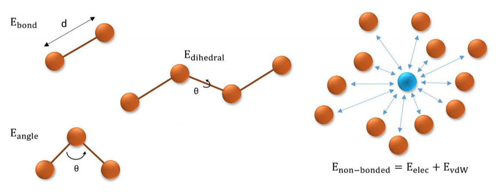

Small molecule force field parametrization for atomistic Molecular Dynamics simulations
========================================================================================

Overview
---------
This **use case** aims to illustrate the process of **parameterizing a small molecule**,
to be used in a Molecular Dynamics simulation, step by step.
The particular example used is the **Imipramine molecule** (PDB code
`IXX <https://www.rcsb.org/ligand/IXX>`_, DrugBank code `DB00458 <http://drugbank.ca/drugs/DB00458>`_).

**Imipramine** is a tricyclic antidepressant (TCA) which is used mainly in the treatment
of **depression**. It can also reduce symptoms of **agitation and anxiety**.

Background
-----------
**Molecular Dynamics (MD) simulation** is the most popular theoretical technique to
obtain **macromolecular dynamic information**. **Classical mechanics** is used to represent
**atoms as spheres** of a given radius, hardness, charge and mass. The **energy functional** used by
**force-fields** is usually composed of two terms: **bonded** and **non-bonded** components:

.. math::
	E_{pot} = E_{bonded} + E_{non-bonded}

where

.. math::
  E_{bonded} = E_{bond} + E_{angle} + E_{dihedral}

and

.. math::
  E_{non-bonded} = E_{elec} + E_{VdW}

The combination of the **force-fields** with the **laws of classical mechanics**
(Newton’s second law of motion), allows the calculation of the
**time evolution** of the system.
**Trajectories** of atoms and molecules are determined by numerically solving
Newton's equations of motion for a system of interacting particles, where forces
between the particles and their potential energies are calculated using
the **force-field energy functionals**.

**Force-field parameters** for **standard amino-acids** and **nucleic acids** exist and are
typically included in **MD packages**. Unfortunately, this is not the case for
**small molecules**. That makes a **ligand parameterization** process mandatory if we
are interested in simulating a **protein-ligand complex**.

How it works ?
--------------

This workflow makes extensive use of the **BioExcel Building Blocks library**
(`biobb <https://github.com/bioexcel/biobb>`_). Each step of the process is
performed by a **building block** (bb), which are wrappers of tools/scripts
that computes a particular functionality (e.g. Solvating a system).
If you are interested in expanding/modifying the current workflow,
please visit the **existing documentation** for each of the packages
`here <https://github.com/bioexcel/biobb>`_.

Most of the steps performed in this pipeline run **GROMACS MD package** tools,
one of the most popular MD packages available.

Although the **pipeline** is presented **step by step** with associated
information, it is extremely advisable to previously spend some time reading
documentation about **small molecule parameterization**, to get familiar with the
terms used, especially for newcomers to the field.

Outcomes / Steps
----------------

This use case will explain:

•	How to fetch a **ligand structure** in PDB format from the **MMB PDB mirror REST API**
•	How to **add hydrogen atoms** to the small molecule
•	How to **energetically minimize** the hydrogen atoms of the molecule
•	How to generate the **ligand parameters**
•	How to **find** and **download** the generated **output files**

Input
------
- A **ligand code** (3-letter code)
- The **ligand net charge**
- The **pH**, acidity or alkalinity for the small molecule. **Hydrogen atoms** will be
  added according to this pH.

Outputs
-------
- **Interactive and 3D vizualisation** of the **intermediate results** on the small molecule
- **Interactive and 3D vizualisation** of the **resulting parameterized structure**
- Collection of **parameter files needed to run an MD simulation** including the
  **small molecule** available to download

Targeted audience
-----------------
All scientists working in biology related areas where protein study is relevant
with a focus on **structural biologists** and **biochemists**. Especially directed to
scientists interested in **protein dynamics** and **flexibility**.
