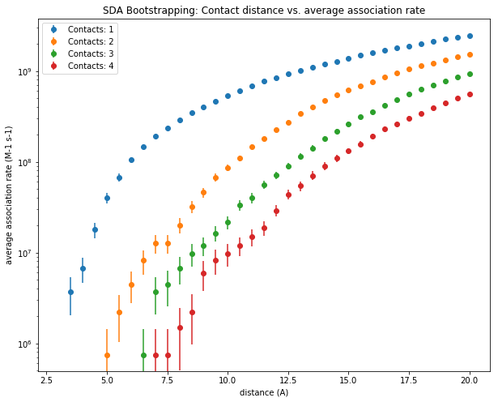

Analyse the results of a Brownian dynamics (BD) simulation for calculating protein-protein association rate constants
=====================================================================================================================
    
Overview
--------

In this use case, we analyse the results of BD simulations of the association of the :math:`G_olf`, :math:`\alpha` - subunit to the enzyme adenylyl cyclase 5 (AC5) [An upcoming use case "Set Up a Brownian Dynamics simulation for calculation of protein association rate constant" will explain how to set up and run these simulations]. 

This use case will explain: 

* The functionality provided by SDA to calculate the biomolecular rate of :math:`G_olf` associating to AC5 by analyzing the contact formation between the two protein species during a set of 50 000 completed Brownian dynamics simulation trajectories.

* The use of a bootstrapping procedure to estimate the error in the predicted rates.

* The use of matplotlib to plot the dependence of association rates on how we define the end point of association based on contact formation.

Background
----------

* How is protein diffusion modeled in Brownian dynamics simulations? 

As the interaction of large biomolecules in solution is a highly complex problem with many degrees of freedom, the diffusional motion of proteins in Brownian dynamics simulations   is often modeled by assuming the proteins to be rigid bodies. Furthermore, their interactions with surrounding water molecules are modeled implicitly (using random forces that mimic the collisions between solutes and water molecules). These assumptions not only speed up the calculation of the systematic forces by allowing the use of precomputed interaction grids, but also allow for larger simulation time steps, as faster vibrational motions are removed. At each simulation step, the position *r* of solute *i* within a system of *N* solutes is propagated using the Ermak-McCammon equation:

.. math::
	\Delta r_{i} = \Delta t\sum_{j=1}^{N}\left ( \frac{\partial \widehat{D}_{ij}}{\partial r_{j}} + \frac{\widehat{D}_{ij}}{k_{B}T} \cdot F_{i} \right ) + R_{i}

where :math:`k_B` and *T* are the Boltzmann constant and simulation temperature, respectively, and :math:`F_i` is the force acting on solute *i* due to its interactions with all other   solutes; :math:`\widehat{D}` is the diffusion tensor for the current configuration of the system, 

and :math:`R_i` is a random displacement vector obtained from the factorization of :math:`\widehat{D}`. The dependence of the diffusion of one solute on the diffusion of all other solutes is due to hydrodynamic interactions, where solutes are able to feel the flow fields in solution created by the other solutes. 

Modelling hydrodynamic interactions is extremely computationally expensive, due to the need to factorize the diffusion tensor

at every time step. In dilute conditions, as we use rigid solutes, we can assume these interactions are negligible, simplifying the equation and removing the need for matrix factorization:

.. math::
	\Delta r_{i} = \frac{\Delta t}{k_{B}T} D_{i}^{T} \cdot F_{i} + R_{i}

where :math:`D_i^T` is the infinite dilution translational diffusion coefficient of solute *i*, and :math:`R_i` is a random vector sampled from a Gaussian distribution with mean zero and a variance of

.. math::
 	\left \langle R_{i}^{2} \right \rangle = 6D_{i}^{T} \Delta t \;. 

A similar equation is used to propagate the rotational motion of the solutes based on the torques acting on them.

For information on the calculation of the contributions to the force :math:`F_i`, see [https://doi.org/10.1002/jcc.23971].

* How can bimolecular association rate constant be computed?

SDA calculates bimolecular association rate constants using the [Northrup, Allison and McCammon](https://doi.org/10.1063/1.446900) method. Here we run many thousands of Brownian  dynamics trajectories, each beginning with the two solutes (in this case proteins) at a separation *b* (shown by the b-surface in the figure below). In each trajectory, we then simulate the diffusion of one solute relative to another, until the solutes are separated by a larger distance *c* (shown by the c-surface in the figure below).

.. figure:: 
	https://projects.h-its.org/mcmsoft/hbpdata/sda_bsurface_csurface.gif
	:width: 300pt

During each trajectory, we monitor the formation of polar contacts present in the native state of the complex formed by the two solutes. If we define a set of reaction criteria that means that a reactive encounter occurs when *N* native contacts are within a certain distance, we can calculate the fraction :math:`\beta` of our trajectories in which these criteria are met, and estimate the bimolecular association rate constant :math:`k_on` from

.. math::
	k_{on} = \frac{k_b\beta}{1-(1-\beta)\frac{k_b}{k_c}}

where :math:`k_b` and :math:`k_c` are the rates at which the solutes diffuse to separations *b* and *c*, respectively. If we assume the interactions between the solutes do not depend on their relative orientations at these large distances, these rates can be calculated analytically.

Input Data
----------

In this example, we estimate the the rate constant of :math:`G_olf` associating to AC5 using a reaction criterion of two contacts at a distance of 6 *Angstrom*.
For this, we downloaded a file called *assoc_bootstrap.log* from CSCS storage. This file gives a concise representation of the results of 50 000 Brownian dynamics simulation trajectories. The header to the file gives some information about the simulations that have been run.

+-------------------+----------------+----------------------------+-----------------------------+-------------------+--------------------+-------+
|:math:`nb_contact` | :math:`nb_win` |:math:`first_win` *Angstrom*| :math:`width_win` *Angstrom*|:math:`b_rate` 1/Ms|:math:`c_rate` 1/Ms | nrun  |
+===================+================+============================+=============================+===================+====================+=======+
| 4                 | 35             | 3.00                       | 0.50                        | 0.231552E+11      | 0.694655E+11       | 50000 |
+-------------------+----------------+----------------------------+-----------------------------+-------------------+--------------------+-------+

In each trajectory, we monitor the formation of up to :math:`nb_contact` native contacts over :math:`nb_wind` distance windows of :math:`width_win`, starting from a distance of :math:`first_win`. The :math:`b_rate` and :math:`c_rate`, correspond to :math:`k_b` and :math:`k_c` in the equation above. In total, *nrun* trajectories were run. The rest of the file is separated into sections corresponding to each number of contacts that we monitor. Each line represents a single trajectory, and contains a number showing the closest window at which that number of contacts was obtained during the trajectory.
      

Interpretation of results
-------------------------

During the 50 000 trajectories described in the log file, we monitor the formation of up to 4 native contacts. In the cells below, we perform bootstrapping by randomly resampling 200 sets of 50 000 trajectories. From there, we will extract the values and convert them to a pandas dataframe, which will then be plotted with matplotlib, and we  save summary data to a set of output files. 

In the figure above, the average association rate constant is plotted on a logarithmic scale against the contact distance in *Angstrom*; when 1 to 4  contacts between the two solutes, as defined by the reaction criteria, are shorter than the contact distance. One can see that the association rate constant decreases the closer the solutes come to each other.  It also decreases as the number of contacts that have to be satisfied increases. These trends can be explained by the decreasing number of ways the two solutes can arrange with respect to each other as the reaction criteria become more stringent.  From this plot, the association rate constant for a given reaction criterion can be extracted and used for further modeling. 

     
