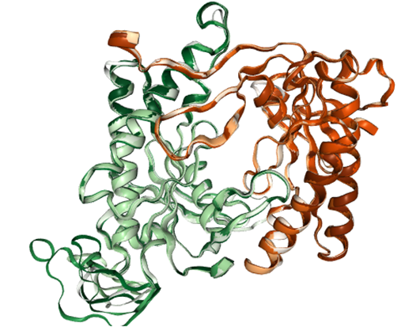
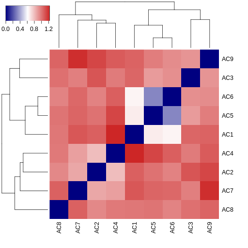

.. _el_multipipsa:

##########################################################################################
Compare the electrostatic potentials surrounding a set of protein isoforms with multipipsa
##########################################################################################

********
Overview
********

This use case describes how multipipsa  software can be used to compare electrostatic potentials of different protein isoforms and to cluster these isoforms by similarity of their electrostatic potentials. 
Multipipsa software tool uses the  following open source software tools:

* PDB2PQR: A tool that takes a protein structure in PDB format, adds missing hydrogen atoms, and creates a structure file in PQR format. The PQR file format is derived from the PDB format for describing atomic data, but with the occupancy and temperature factor fields replaced with atomic partial charges and radii.

* APBS: A tool that calculates electrostatic potentials through solution of the Poisson-Boltzmann equation, one of the most common continuum models for describing electrostatic interactions between molecular solutes in salty, aqueous media.

|

**********
Background
**********

* For details on computation of the electrostatic potential see :ref:`electrostatic_potential` 

* PIPSA analysis: PIPSA provides a method for quantitatively comparing the three dimensional interaction property fields of a set of structurally similar proteins. The structures of the proteins must be suitably aligned for the comparison to be reasonable. The method was first described in |doi_blomberg|. In this use case, the interaction property we consider is the electrostatic potential. In the PIPSA method, interaction potential fields are discretised on three dimensional grids, and compared at grid points lying within a skin surrounding the proteins. The skin of the protein is defined as the region beginning at a distance  :math:`\sigma` from the van-der-Waals surface of the protein's atoms with a thickness  :math:`\delta` . Commonly used parameters for this skin are :math:`\sigma`  =3 Angstrom and :math:`\delta`  = 4 Angstrom. The region to be compared can be further restricted as the intersection of this skin with a sphere or as cone (as shown in the figure below).

.. |doi_blomberg| raw:: html  

    <a href="https://doi.org/10.1002/(SICI)1097-0134(19991115)37:3<379::AID-PROT6>3.0.CO;2-K" target="_blank">Blomberg et al (1999)</a>

    
.. figure:: protein_surface.png

|

* Similarity measure: The interaction fields of two structures can be compared quantitatively by calculating pairwise similarity indices. One such measure is the Hodgkin index, which is given by:

.. container:: bsp-container-center

    .. image:: SI12_equation.png
        :scale: 90%
        :align: right

where *(p1,p2)(p1,p2)* is the scalar product of the fields surrounding proteins 1 and 2 in the analysis region. They can be calculated as:

|

.. math::
 (p1,p2) = \sum_{i,j,k}ϕ_1(i,j,k)ϕ_2(i,j,k)

where  *i*, *j* and *k* are the three-dimensional spatial coordinates, and  :math:`ϕ_1(i,j,k)ϕ_2(i,j,k)`   is the potential at point  *(i,j,k)*  on the grid for the template protein. The similarity index runs from  −1 , for completely anti-correlated potentials, to  1  for identical potentials. At 0 , there is no correlation between the two potentials. The pairwise similarity can be converted to a distance measure, for use in clustering, using

.. container:: bsp-container-center

    .. image:: D12_equation.png
        :scale: 90%
        :align: right

|

**********
Input Data
**********

In this use case, we use as our input structure a structure of the catalytic domain of the enzyme adenylyl cyclase 5 (AC5), modelled during the work described in |doi_tong|. 
The structures of the AC isoforms were created via homology modelling using the same template. The region where there are significant structural differences between the isoforms is in a flexible loop region that was not defined in the template structure. There are also variations in sequence length across AC isoforms in this region. 

.. |doi_tong| raw:: html  

    <a href="https://doi.org/10.1002/prot.25167" target="_blank">Tong et al (2016)</a>

|

*********
Procedure
*********

* Structure of AC5 is visualized. The catalytic domain of AC5 is a dimer consisting of two protein chains. In the full structure of AC5 these are two chains connected by a series of transmembrane helices that anchor the protein in the post-synaptic membrane.

* Then the Pdb2Pqr method is used to generate hydrogen atoms in the protein structure. Proteins contain a number of ionisable amino acids, which can exist in different protonation states, depending on the pH of the solution they are in. PDB2PQR can predict the states of these amino acids, at a given pH (defined as 7.4, a normal physiological pH), then add all missing hydrogen atoms to the structure, and assign atomic charges and radii to all atoms. By default, multipipsa assigns charges and radii from the Amber force field. 

* The  APBS method is used to solve the linearised Poisson-Boltzmann equation to obtain the electrostatic potential in the dx and UHBD file formats. It also creates a dx file describing the solvent excluded volume of AC5. This is used for visualisation later.

* Finally, electrostatic similarity between AC isoforms is computed.

|

*******
Results
*******

Visualization of the AC5 dimer structure:

|

The MultiPIPSA analysis creates as output an image file showing the pairwise distances between AC isoforms as a 2D heatmap. The results are also clustered using a single linkage hierarchical method. The resulting dendograms are shown along the edges of the heatmap. 

