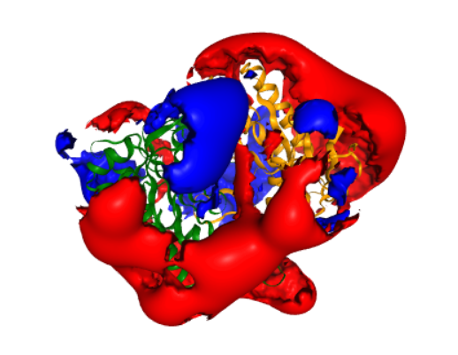

Calculate the electrostatic potential of a protein from its atomic structure
============================================================================

Overview
--------

This use case describes how you can calculate an electrostatic potential surrounding a protein in aqueous solution. It uses the multipipsa software tool, which helps to automate these calculations by providing a python wrapper for the following open source software tools:

* PDB2PQR: A tool that takes a protein structure in PDB format, adds missing hydrogen atoms, and creates a structure file in PQR format. The PQR file format is derived from the PDB format for describing atomic data, but with the occupancy and temperature factor fields replaced with atomic partial charges and radii.

* APBS: A tool that calculates electrostatic potentials through solution of the Poisson-Boltzmann equation, one of the most common continuum models for describing electrostatic interactions between molecular solutes in salty, aqueous media.

* In addition to automating these calculations, the main use of multipipsa is to compare the electrostatic potentials surrounding a set of similar protein structures. These comparisons are described in other molecular use cases.

Background
----------

* What is an electrostatic potential?

An electrostatic potential *ϕ*  describes the potential energy of a unit charge located at a position *r* in an electric field. In a uniform dielectric medium with a dielectric constant *ϵ*, the electrostatic potential at a position *r* due to a set of fixed charges :math:`q_i` can be calculated from Coulomb's equation:

.. math::
	ϕ(r) = \sum_{i} \frac{q_i}{4 \pi \epsilon r_i}

where :math:`r_i` is the distance from point **r** to the :math:`i^{th}` charge. For a protein in solution, we no longer have a uniform dielectric, as the interior has a much lower dielectric than the solvent. Here, we can calculate the potential by solving the Poisson equation:

.. math::
	▽(−\epsilon (r)⋅▽ϕ(r))=ρ(r)

which links the gradient of the electrostatic field :math:`(−\epsilon (r)⋅▽ϕ(r))` with the charge density *ρ(r)*. Biological solvents are rarely pure water, and instead contain small dissolved charged ions. The total charge density in the region of the protein is then represented by the charge density due to the fixed charges in the protein (*p(r)*) and the dissolved ions, which are assumed to have a Boltzmann distribution. This leads to the Poisson-Boltzmann equation:

.. math::
	▽(−\epsilon (r)⋅▽ϕ(r))=ρ_0(r) + ρ(r) \sum_{i}z_i e_l c_i^0 exp{ \left( \frac{\partial z_i e_l ϕ(r)}{\partial k_B T} \right)}

where :math:`z_i` is the net atomic charge of dissolved ion type *i*, :math:`c_0` is its bulk concentration, :math:`e_l` is the elementary charge, :math:`k_B` is the Boltzmann constant and T the temperature. If the argument of the exponential function is small, and there is a 1:1 ratio of positive and negative charge ions of equal magnitude, this differential equation can be linearised to simplify its solution.

Input Data
----------

In this use case, we use as our input structure a structure of the catalytic domain of the enzyme adenylyl cyclase 5 (AC5), modelled during the work described in Tong et al (2016)[https://doi.org/10.1002/prot.25167]. The following cell downloads this structure from the CSCS storage area.

Procedure
---------

* Structure of AC5 is visualized. The catalytic domain of AC5 is a dimer consisting of two protein chains. In the full structure of AC5 these two chains are connected by a series of transmembrane helices that anchor the protein in the post-synaptic membrane.

* Then the Pdb2Pqr method is used to generate hydrogen atoms in the protein structure. Proteins contain a number of ionisable amino acids, which can exist in different protonation states, depending on the pH of the solution they are in. PDB2PQR can predict the states of these amino acids, at a given pH (defined as 7.4 in the last cell, a normal physiological pH), then add all missing hydrogen atoms to the structure, and assign atomic charges and radii to all atoms. By default, multipipsa assigns charges and radii from the Amber force field.

* The  APBS method used to solve the linearised Poisson-Boltzmann equation to obtain the electrostatic potential in the dx and UHBD file formats. It also creates a dx file describing the solvent excluded volume of AC5. This is used for visualization later.

Results
-------

.. figure:: complex.png

This figure illustrates a structure of enzyme adenylyl cyclase 5 (AC5) .

This is a representation of a molecular viewer that demonstrates a computed electrostatic potential. The potential is set to zero inside the solvent excluded volume of AC5, to make visualization easier. The potential is displayed as two isopotential surfaces, at potentials of 1 :math:`k_B T/e`  (blue) and :math:`-k_B T/e`  (red). For comparison, the same potential is shown in Figure 4F of Tong et al (2016) [https://doi.org/10.1002/prot.25167].
