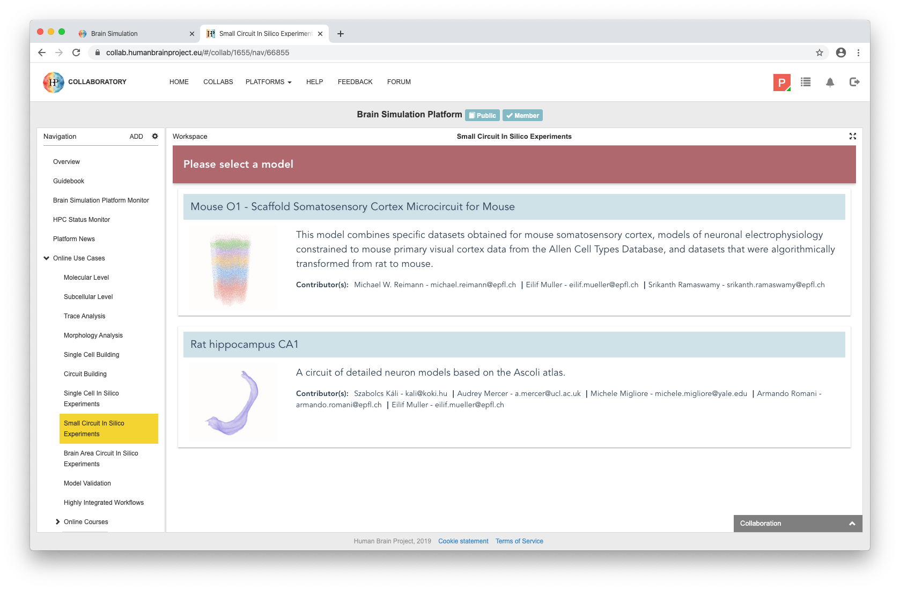
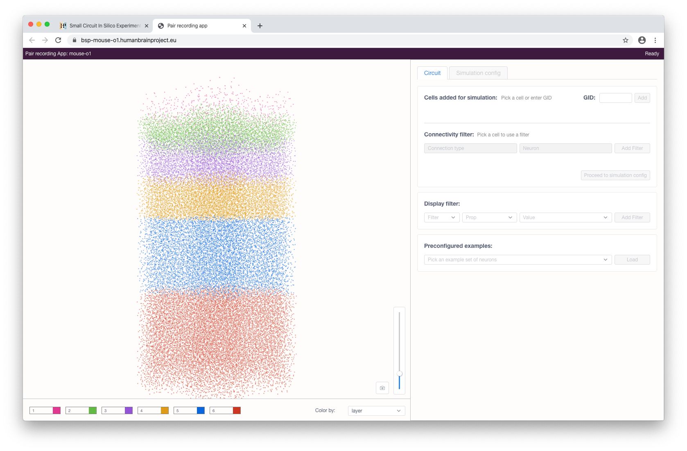
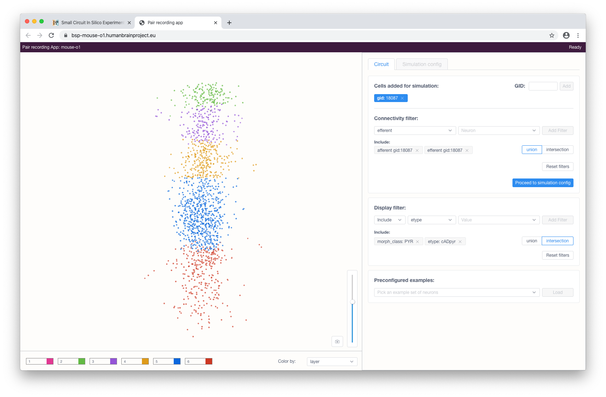
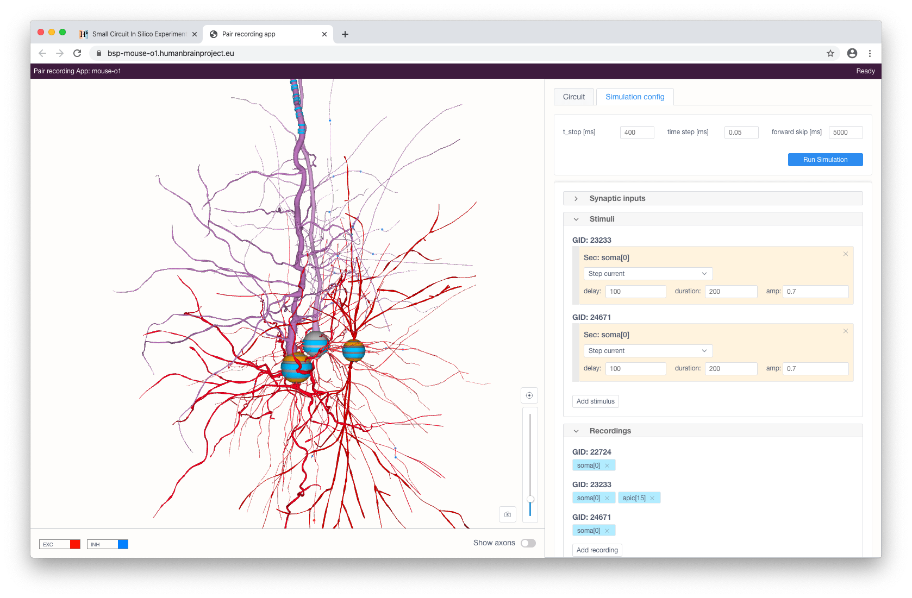

===========================================================================================
In silico experiments of a small circuit extracted from large scale detailed network models
===========================================================================================

This use case, implemented through the Pair Recording application, is a web 
environment for a small circuit in-silico experiments.

It provides an extended toolset to configure and run simulations of single cell
models as well as multiple connected neurons from a given circuit.
The application's graphical user interface allows the user to define, in a first
step, a small circuit composed of several connected neurons, and, in a second
step, to experiment on this circuit by defining a stimulation and reporting
protocol.

Usage
=====

The Use Case can be found among the `Online Use Cases` under the
`Small Circuit In Silico Experiments` menu, in the `Brain Simulation Platform`.
The user can select a base circuit from the list to open the Pair Recording
application.

The workflow consists of the following three steps:

#. selecting a small circuit of several connected neurons
#. configuring stimulation and reporting protocols
#. running a simulation and inspecting its results

When the application has been started (on the initial load it will fetch
the necessary circuit information - e.g. circuit info, cell locations and
properties - so this might take some time) an interactive circuit visualisation
will appear with controls facilitating the cell selection.

Cells in the view are color-coded by one of their properties. The user can
change this property via the `Color by` selection menu in the bottom of the view.
The form on the right consists of various controls and allows the user to filter
and select the cells. Two types of filters are available: property and
connectivity.

Property (display) filters can be used to show only cells with particular
properties (including subtypes) or filter out a subset of particular cells based
on their properties. By default, multiple added filters use OR (union) logic to
compose a subset of cells. When required, the user can switch this
mode to the AND (intersection) logic. This applies to both types of filters:
`include` and `exclude`. Connectivity filters can be used to show neurons with
afferent/efferent connections to/from a selected cell.

Cells can be selected for later simulations by clicking on them in the
interactive view or, if known beforehand, by specifying their `gid` in the form
and clicking the `Add` button.

When the cell selection is done, the user can proceed to the simulation 
configuration by clicking the corresponding button. This will load and render the
morphologies of the selected cells.

.. image:: images/step_4.png
   :width: 800 px

The user can stimulate and/or record specific compartments by clicking on them 
and choosing the type of instrument to be added (stimulus, recording or
synaptic input - the latter is only available for somas). Each added stimulus
and synaptic input can be configured in the right panel.

Available types of stimuli are:

* step current
* ramp current
* pulse current (soma only)
* voltage clamp (soma only; this will add current recording automatically)

Synaptic input will provide a cell with a presynaptic spike train of a
given frequency with Poisson distribution for synaptic contacts with the selected
pre-synaptic cells (filtered by a given pre-synaptic cell property).

When stimuli and recordings are configured, the user can proceed to start
a simulation with the given parameters. This can be done by clicking on the
`Run simulation` button at the top right of the panel. After a simulation
has been initialized, voltage and current recording graphs will appear
according to the selected recordings and will update in real-time while 
the simulation is running.

.. image:: images/step_6.png
   :width: 800 px

The simulated activity can be downloaded in CSV format by clicking on the
corresponding button in the bottom right part of the chart.
