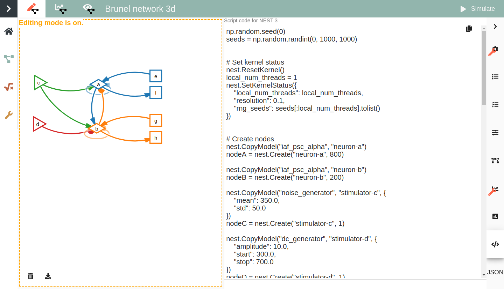
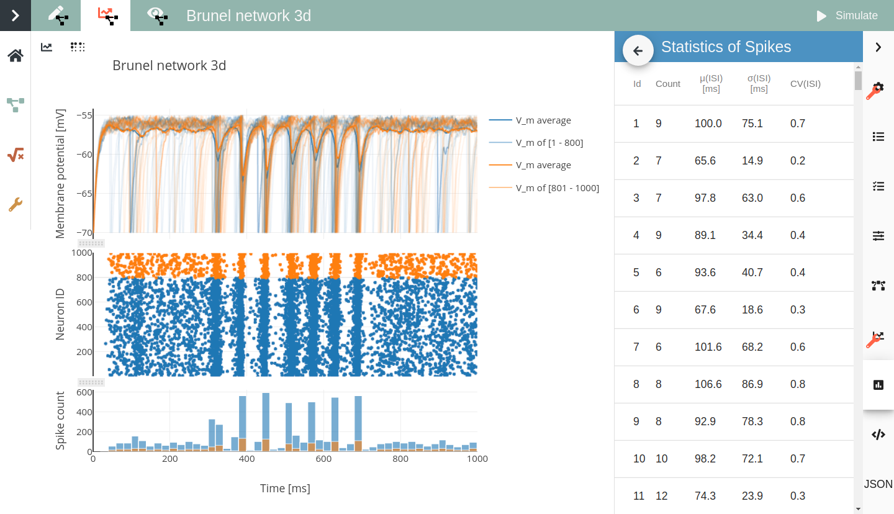

=============
 NEST Desktop
=============

NEST Desktop is a web-based GUI application for NEST Simulator, 
an advanced simulation tool for computational neuroscience. NEST 
Desktop enables the rapid construction, parametrization, and instrumentation 
of neuronal network models. It offers interactive tools for visual network construction, 
running simulations in NEST and applying visualization to support the analysis of 
simulation results.

The Graphical User Interface
============================

NEST Desktop mainly consists of two views and a connection to a server-based NEST instance, 
which can be controlled using the web-based NEST Desktop front-end. The first view of 
NEST Desktop enables the user to create point neuron network models interactively (Fig. 1). 
A visual modeling language is provided and a simulation script is automatically created from this visual model. 
The second view enables the user to analyze the returned simulation results using various visualization methods (Fig. 2).

NEST Desktop offers additional functionality, such as employing Elephant for more sophisticated statistical analyses. 
More information on the full feature set and operation can be found in the user documentation of NEST Desktop 

https://nest-desktop.readthedocs.io/en/latest/user/index.html

**Figure 1**: Interactive editor for network construction (left) and generative script code (right).  

**Figure. 2**: Explore network activity in chart panels (left) and in statistics (right). 
   
Getting Access & Documentation
==============================

One can deploy NEST Desktop locally following the deployment documentation 
(https://nest-desktop.readthedocs.io/en/latest/deployer/index.html). 
Alternatively, one can use the NEST Desktop setup provided by the 
EBRAINS infrastructure as NEST Desktop is a web application
 
https://nest-desktop.apps.hbp.eu   
 
To get an overview of how to use it, please have a look at the QuickStart Section of NEST Dekstop’s documentation
 
https://nest-desktop.readthedocs.io/en/latest/user/quickstart.html
 
The full document of NEST Desktop can be found here
 
https://nest-desktop.readthedocs.io/en/latest/user/index.html
