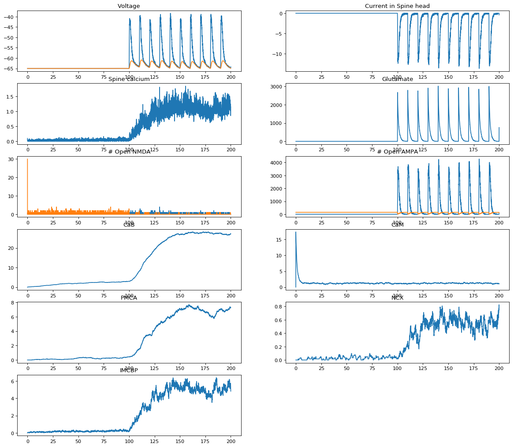

============================
Synaptic plasticity pathways
============================

As discussed in the previous section, the motivation is to model the
interaction between electrical activity in neurons and the synaptic
proteome. This example (currently at
https://collab.humanbrainproject.eu/#/collab/2184/nav/303192) shows
how interactions between a number of ions, proteins and second
messengers can be modeled.

Proteins involved
-----------------

The full list of "agents" in the `molecule_definitions.ka` file is:

.. code:: python  
   :number-lines:

   %agent: ca(x)
   %agent: Glu(x)
   %agent: NMDA(x, b0, b1, state~R~RA~RA2~d1~d2~2f~2s~o, type~A~B, mgb)
   %agent: mg(x)
   %agent: AMPA(x, loc~m~b~t, ser845~u~p, ser831~u~p, b1, b2, b3, b4, state~c0~c1~c2~c3~c4~d1~d2~d3~d4~o1~o2~o3~o4)
   %agent: PMCA(x, cam)
   %agent: NCX(x)
   %agent: IMCBP(x)
   %agent: CaB(h1, h2, h3, m1)
   %agent: CaM(site1, c1, c2, n1, n2)
   %agent: CaMKII(A, B, D, cam, sub, phos, Thr286~u~p, Thr305~u~p)
   %agent: NG(cam)
   %agent: CaN(cam, sub, m1, m2)
   %agent: AC1(cam)
   %agent: AC8(cam, camLoc~none~nLobe~cLobe)
   %agent: PDE1B(x, cam, phos~u~p)
   %agent: PDE4(x, pka, phos~u~p)
   %agent: cAMP(x)
   %agent: PKA(x, A1, B1, A2, B2, type~f~r~c) #full/regulatory/catalytic
   %agent: I1(x, thr35~u~p)
   %agent: PP1(x, i1)

Rules
-----
   
These lines from the `molecule_definitions.ka` demonstrate how binding
cAMP to PDE4 in an unphosphorylated state:

.. code:: python  

   'PDE4 binding cAMP' PDE4(x, phos~u), cAMP(x) -> PDE4(x!1, phos~u), cAMP(x!1) @ 'PDE4cAMPk+'
   'PDE4 unbinding cAMP' PDE4(x!1, phos~u), cAMP(x!1) -> PDE4(x, phos~u), cAMP(x) @ 'PDE4cAMPk-'
   'PDE4 destroys cAMP' PDE4(x!1, phos~u), cAMP(x!1) -> PDE4(x, phos~u) @ 'PDE4cAMPcat'

These lines demonstrate phosphorylation of PDE4 by PKAc: 

.. code:: python  

   'PKAc phosphorylating PDE4' PKA(x!1, type~c), PDE4(x!1, phos~u) -> PKA(x, type~c), PDE4(x, phos~p) @ 'PKAPDE4cat'
   '4Ca-CaM-CaN dephosphorylating PDE4 phos' CaN(cam!2, sub!1),
   CaM(site1!2, c1!_, c2!_, n1!_, n2!_), PDE4(x!1, phos~p) ->
     CaN(cam!2, sub), CaM(site1!2, c1!_, c2!_, n1!_, n2!_), PDE4(x, phos~u) @ 'CaNPDE4cat'

Results
-------

The output of the simulation is shown below:

   
..  LocalWords:  KappaNEURON PSD Sterratt CaMKII BNGL GHK px caPump
..  LocalWords:  SpatialKappa ka agconc mM LHS init KaSim dt Glu NMDA
..  LocalWords:  mgb AMPA loc ser PMCA NCX IMCBP CaB phos Thr NG CaN
..  LocalWords:  camLoc nLobe cLobe PDE pka cAMP thr cAMPk cAMPcat
..  LocalWords:  PKAc PKAPDE CaNPDE
