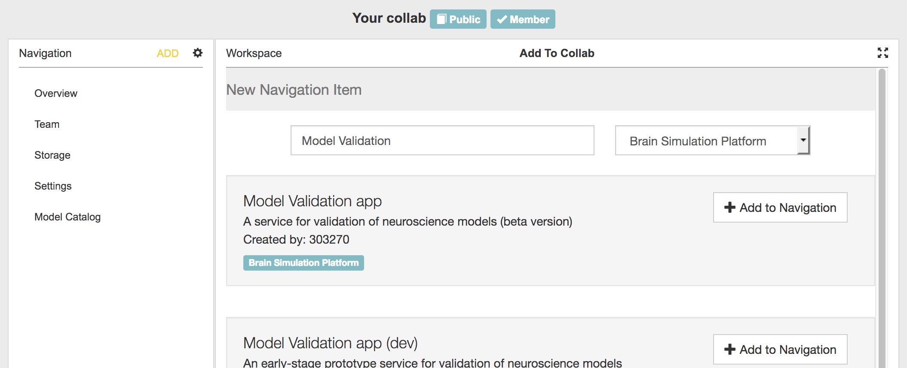
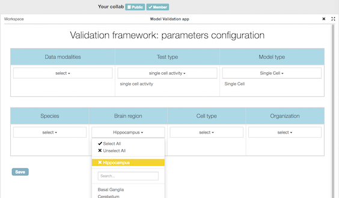
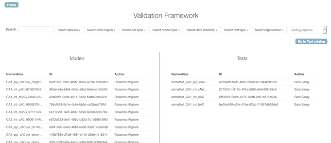
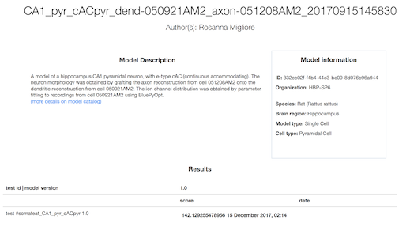
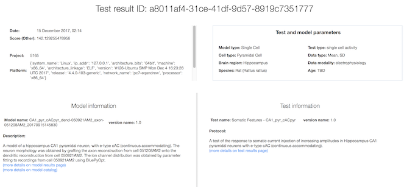
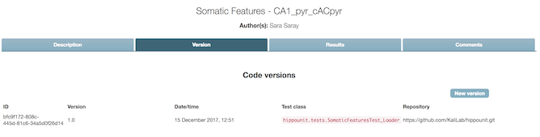
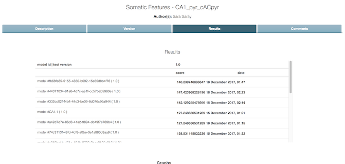
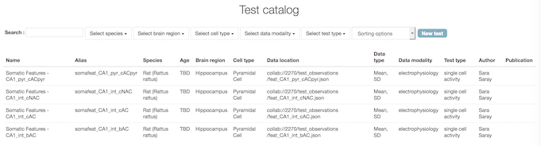

####################
Model Validation app
####################

Validation is the process of comparing a model
(more precisely, the results of computer simulations of the model) to experimental data.

The Model Validation app can be installed in any Collab workspace, and can be used:

- to search for validation tests appropriate to a given model type 
  (e.g. tests for models of hippocampus CA1 pyramidal cells);
- to view the results of validation tests, including:

  - seeing all the tests for a given model
  - tracking changes in test results over time (as the model being tested is modified)
  - comparing different models of the same system

- to register new validation tests with the HBP validation test library.

.. note:: 

    - Uploading test results to the database requires the `validation framework Python client`_.
      In future the upload will be integrated into many of the online use cases of the Brain Simulation platform.
    - To register new models for validation, use the :ref:`model-catalog-app`.

Adding the app to your Collab
-----------------------------

As shown in the screenshot below, click on the “ADD” button in the left-hand navigation bar,
then search for “validation”, and click on “Add to Navigation” to install the app.

Choosing which models and tests to view
---------------------------------------

When you first click on "Model Validation app" in the navigation bar,
you will see a configuration screen with a group of drop-down lists.
This allows you to filter the catalog, and show only the validation tests and models that are relevant to your Collab.

When you have finished, click "Save", and then click the "X" icon to close the configuration view.
You will now see the home page of the app, showing a list of models and validation tests corresponding to the criteria you have selected.

Viewing the results for a particular model
------------------------------------------

If you click on one of the models in the left-hand list, you will see a page with details about the model,
a table summarizing all the validations of that model (only one in this screenshot), and one or more graphs
showing the numerical scores for the validations (not shown).

If you then click on the value in the score column, it will open a page showing details about that test result,
including the model that was tested, information about the validation test, and links to additional figures or
data generated by the test simulation.

.. image:: images/validation-app-result-detail2.png
   :width: 678
   :align: center

Viewing the results for a particular test
-----------------------------------------

From the home page, if you click on one of the validation tests in the right-hand list,
you will see a page with details about the test, divided into four tabs.

The **Description** tab shows basic information about the test, including a link to the experimental
data against which models are validated.

.. image:: images/validation-app-test-description.png
   :width: 669
   :align: center

The **Version** tab shows information about the test implementation(s) (as Python code).

The **Results** tab shows the test scores for all models that have been validated with this test.

Finally, the **Comments** tab 

.. image:: images/validation-app-test-comments.png
   :width: 674
   :align: center

Browsing the test library
-------------------------

From the app home page, clicking on "Go to Test catalog" will take you to a list of validation tests
for the test and model types you specified in the configuration page. This list can make it easier to
compare tests and see the differences between them, and provides another route to access the results
for a given test.

Adding a new validation test
----------------------------

From the test library, clicking on "New test" opens a form which allows you to define a new test,
including the URL of the source code repository containing the test implementation.

.. image:: images/validation-app-new-test.png
   :width: 676
   :align: center

.. _`validation framework Python client`: http://hbp-validation-client.readthedocs.io
